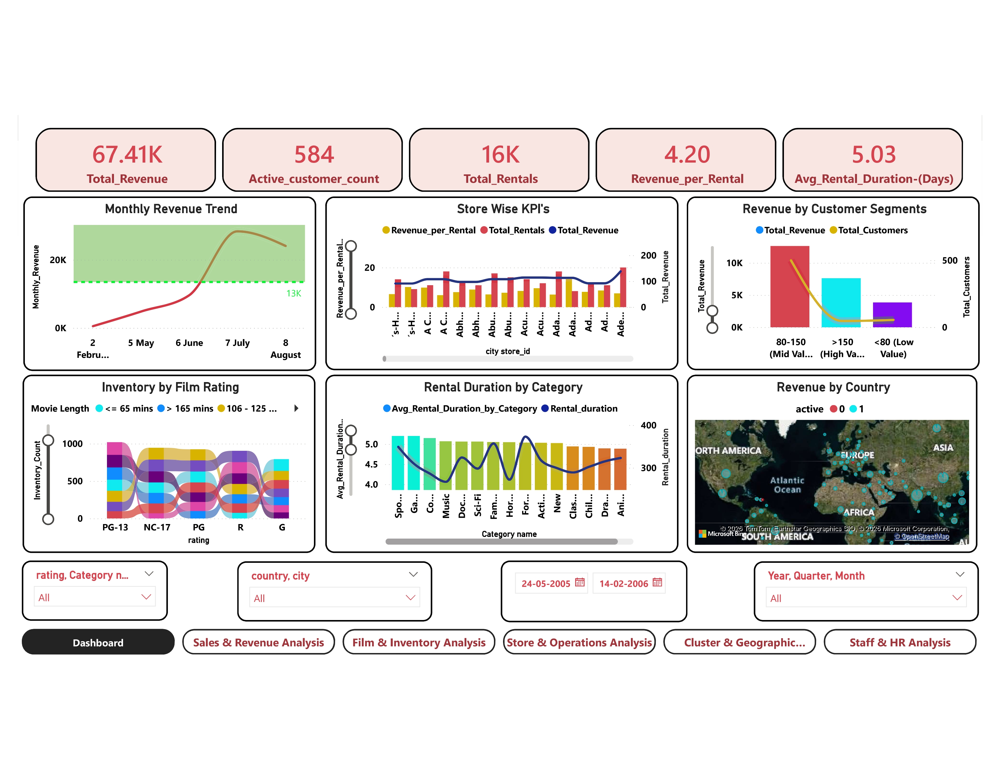
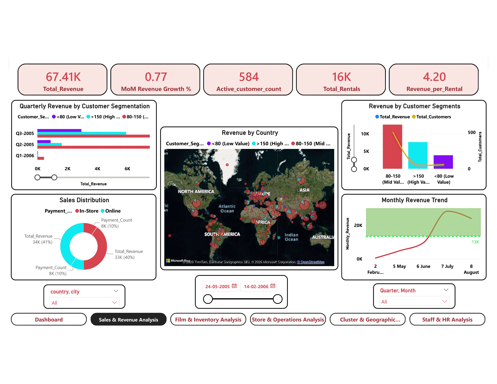
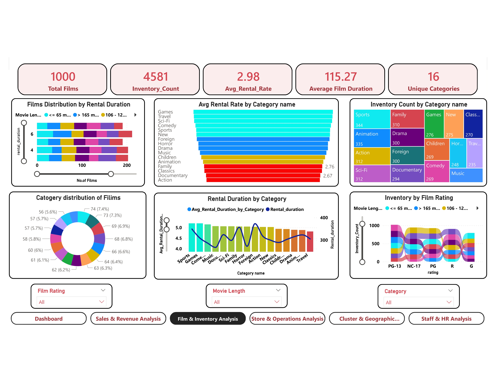
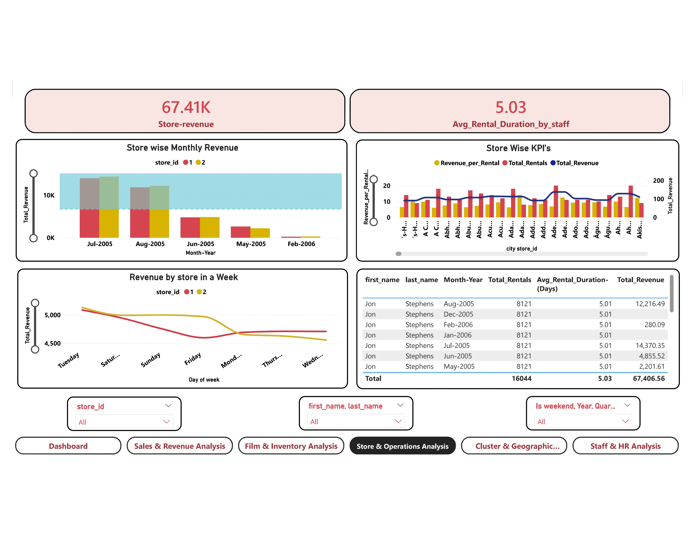
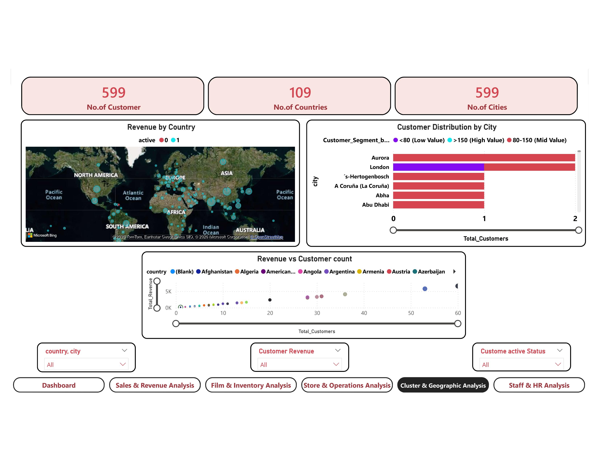
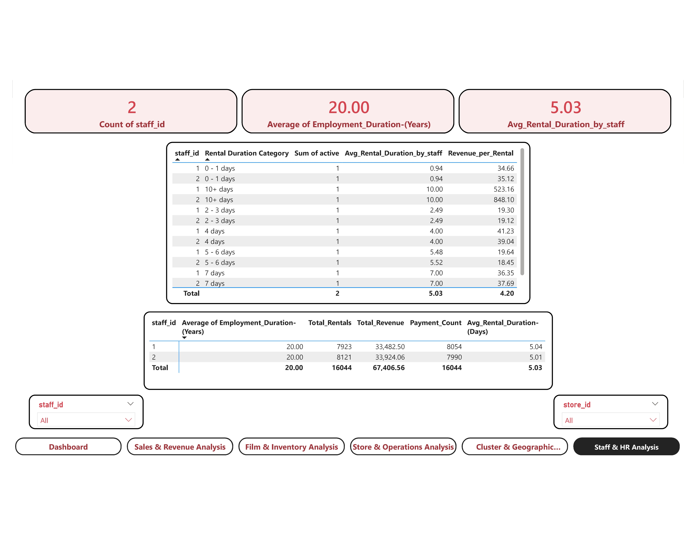

# Movie Rental Analytics (Sakila DVD Rental Store) — Data Analytics Dashboard
> Power BI | SQL | Excel | End-to-End Analytics Project
---
## Problem Statement
The objective of this project is to build a comprehensive Power BI dashboard
for the Sakila DVD Rental Store — a sample database representing a fictitious
DVD rental business with stores, customers, films, staff, and rental records.
The report delivers insights across four key areas:
- **Customer Behaviour** — segmentation, top customers, retention patterns
- **Film & Inventory** — category performance, utilisation, top/bottom films
- **Staff Performance** — transaction counts, revenue handled per staff member
- **Revenue & Store Operations** — trends, store comparison, seasonal patterns
The expected outcome is to empower store owners with interactive, data-driven
visualisations that support faster and better business decisions.
---
## Dataset Description
**Source:** Sakila Sample Database (MySQL reference database)
**Domain:** DVD rental store operations
**Tables:** 16 relational tables
| Table | Key Fields |
|----------------|--------------------------------------------------------|
| customer | customer_id, first_name, last_name, email, store_id |
| film | film_id, title, rating, rental_rate, length |
| film_category | film_id, category_id |
| category | category_id, name |
| inventory | inventory_id, film_id, store_id |
| rental | rental_id, customer_id, inventory_id, rental_date |
| payment | payment_id, customer_id, amount, payment_date |
| staff | staff_id, first_name, last_name, store_id |
| store | store_id, manager_staff_id, address_id |
| actor | actor_id, first_name, last_name |
| film_actor | film_id, actor_id |
| address | address_id, city_id, address |
| city | city_id, city, country_id |
| country | country_id, country |
| language | language_id, name |
| film_text | film_id, title, description (full-text sync) |
---
## Project Structure
| Folder | Contents |
|---------------------------|----------------------------------------------|
| 01_Problem_Statement/ | Problem statement document |
| 02_Data_Description/ | Table-by-table dataset notes |
| 03_MECE_Breakdown/ | MECE framework breakdown PDF |
| 04_EDA_Analysis/ | EDA + SQL Analysis workbook (Excel) |
| 05_Power_BI_Report/ | Main Power BI dashboard .pbix file |
| 06_Presentations/ | Report Analysis + Business Questions PPTs |
| 07_Dashboard_Screenshots/ | All 6 dashboard page previews (.jpg) |
---
## Dashboard Preview
### Overview Dashboard

### Revenue Trends

### Film & Inventory

### Store Operations

### Customer Analysis

### Staff Performance

---
## Tools Used
| Tool | Purpose |
|------------|--------------------------------------------------|
| Power BI | Dashboard, KPIs, interactive visuals |
| SQL | Data extraction, EDA, business queries |
| Excel | EDA workbook, pivot analysis, SQL reference |
| PowerPoint | Report analysis + business questions presentation|
---
## Project Deliverables
| # | Deliverable | File | Status |
|---|------------------------------|-------------------------------------------|--------|
| 1 | MECE Breakdown | 03_MECE_Breakdown/Movie_Rental_Analysis_MECE_Breakdown.pdf| ■ |
| 2 | EDA + SQL Analysis | 04_EDA_Analysis/Movie_Rental_Analysis_EDA_SQL_Analysis.xlsx| ■ |
| 3 | Power BI Dashboard | 05_Power_BI_Report/Movie_Rental_Analysis_Dashboard_Report.pbix| ■|
| 4 | Report Analysis PPT | 06_Presentations/Movie_Rental_Analysis_Report_Analysis.pptx| ■ |
| 5 | Business Questions PPT | 06_Presentations/Movie_Rental_Analysis_Business_Questions.pptx| ■|
| 6 | Dashboard Screenshots | 07_Dashboard_Screenshots/ (6 JPG files) | ■ |
| 7 | Presentation Video | 06_Presentations/Movie_Rental_Analysis_Video.mp4| ■ |
---
## Video Demo
🎥 Full dashboard walkthrough video is available in the repository:
A complete narrated walkthrough of the Power BI dashboard, business insights, and recommendations is available below:

▶ [Watch / Download Presentation Video](06_Presentations/Movie_Rental_Analysis_Video.mp4)
